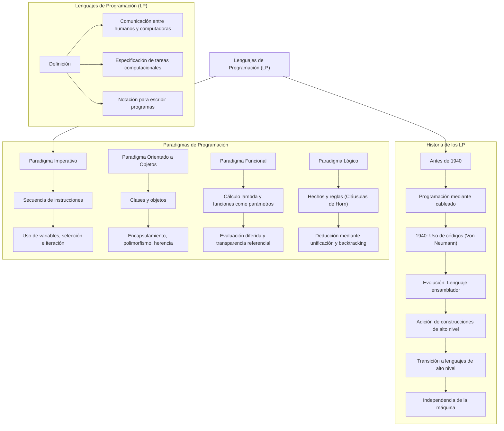

```mermaid
    graph TD
    subgraph "Lenguajes de Programación (LP)"
        direction LR
        A["Definición"] --> B["Comunicación entre humanos y computadoras"]
        A --> C["Especificación de tareas computacionales"]
        A --> D["Notación para escribir programas"]
    end

    subgraph "Historia de los LP"
        direction TB
        H1["Antes de 1940"] --> H2["Programación mediante cableado"]
        H2 --> H3["1940: Uso de códigos (Von Neumann)"]
        H3 --> H4["Evolución: Lenguaje ensamblador"]
        H4 --> H5["Adición de construcciones de alto nivel"]
        H5 --> H6["Transición a lenguajes de alto nivel"]
        H6 --> H7["Independencia de la máquina"]
    end

    subgraph "Paradigmas de Programación"
        direction TB
        P1["Paradigma Imperativo"] --> PI1["Secuencia de instrucciones"]
        PI1 --> PI2["Uso de variables, selección e iteración"]

        P2["Paradigma Orientado a Objetos"] --> POO1["Clases y objetos"]
        POO1 --> POO2["Encapsulamiento, polimorfismo, herencia"]

        P3["Paradigma Funcional"] --> PF1["Cálculo lambda y funciones como parámetros"]
        PF1 --> PF2["Evaluación diferida y transparencia referencial"]

        P4["Paradigma Lógico"] --> PL1["Hechos y reglas (Cláusulas de Horn)"]
        PL1 --> PL2["Deducción mediante unificación y backtracking"]
    end

    LP["Lenguajes de Programación (LP)"] --> H1
    LP --> P1
```