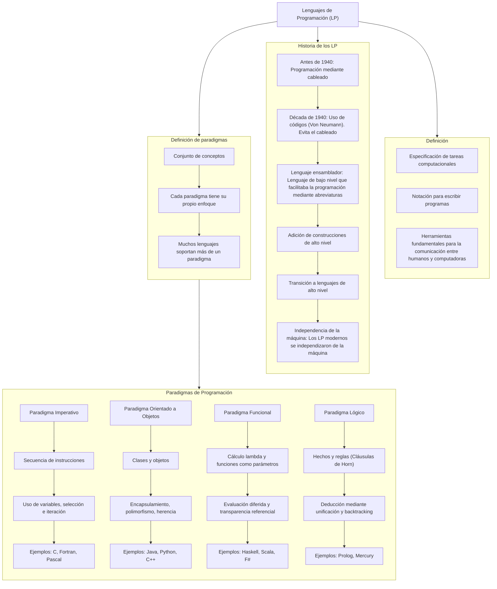
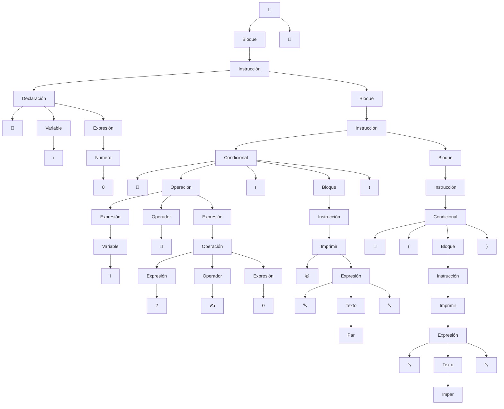

# Caracteristicas_Lenguajes_Programacion
# TP 1


# TP 3

# Gramáticas Formales para Emojicode: GIC, BNF, EBNF y ABNF

Emojicode es un lenguaje de programación esotérico de propósito general que utiliza emojis como elementos sintácticos primarios. Representa una fusión única entre:

Semántica de lenguajes convencionales (como Python o Java)

Sintaxis basada completamente en Unicode Emoji

Paradigmas de programación orientada a objetos y procedural

### Origen y Filosofía:
Creado en 2016 por Theo Weidmann, surge como crítica/exploración de:

La universalidad de los emojis como lenguaje visual global

La posibilidad de construir sistemas formales sobre símbolos no tradicionales

Un experimento sobre cognición y programación

## 1. GIC (Gramática Independiente del Contexto) para Emojicode

```plaintext
Programa       → 🏁 Bloque 🍉
Bloque         → Instrucción Bloque | Instrucción | λ
Instrucción    → Imprimir | Declaración | Bucle | Condicional | λ
Imprimir       → 😀 Expresión
Declaración    → 🍿 Variable Expresión
Bucle          → 🔁 Expresión ( Bloque )
Condicional    → 🤔 Operación ( Bloque ) | 🤔 Operación ( Bloque ) 🙁 ( Bloque ) 
Expresión      → 🔤Texto🔤 | Variable | Número | Operación
Operación      → Expresión Operador Expresión
Operador       → ➕ | ➖ | ✖️ | ➗ | ✍️ | 🚮
Variable       → A|B|C| ... |Z|a|b|c|...|z
Número         → 0|1|...|9
Texto          → Variable | Número     
```

---

## 2. BNF para Emojicode


```bnf
<Programa>    ::= 🏁 <Bloque> 🍉
<Bloque>      ::= <Instrucción> <Bloque> | λ
<Instrucción> ::= <Imprimir> | <Declaracion> | <Bucle> | <Condicional>
<Imprimir>    ::= 😀 <Expresión>
<Declaracion> ::= 🍿 <Variable> <Expresión>
<Bucle>       ::= 🔁 <Expresión> (<Bloque>)
<Condicional> ::= 🤔 <Operación> (<Bloque>) [🙁 <Bloque>]
<Expresión>   ::= 🔤<Texto>🔤 | <Variable> | <Número> | <Operación>
<Operación>   ::= <Expresión> <Operador> <Expresión>
<Operador>    ::= ➕ | ➖ | ✖️ | ➗ | ✍️ | 🚮
<Variable>    ::= A|B|C| ... |Z|a|b|c|...|z
<Número>      ::= 0|1|...|9
<Texto>       ::= <Variable> | <Número> 
```
---

## 3. EBNF para Emojicode

```ebnf
Programa     = 🏁 Bloque 🍉

Bloque       = { Instrucción }

Instrucción  = Imprimir | Declaración | Bucle | Condicional

Imprimir     = 😀 Expresión;

Declaración  = 🍿 Variable Expresión  

Bucle        = 🔁 Expresión (Bloque)

Condicional  = 🤔 Operación (Bloque) [🙁 (Bloque)]

Expresión    = 🔤Texto🔤 | Variable | Número | Operación |  Expresión 

Operación    = Expresión Operador Expresión

Operador     = ➕ | ➖ | ✖️  | ➗ | ✍️ | 🚮

Variable     = letra { letra | digito | _ }*

Número       = [ + | - ] digito { digito }*

Texto        = { letra* | digito* } 

letra       =  A | ... | Z | a | ... | z

digito        = 0 | ... | 9
```

---

## 4. ABNF para Emojicode


```abnf
programa : 🏁  
           bloque 
           🍉  

bloque : instruccion 
         bloque instruccion

instruccion : 😀 expresion  
              🍿 variable expresion  
              🔁 expresion (bloque)  
              🤔 Operación (bloque) 🙁 (bloque)

expresion : 🔤 cadena 🔤 
            numero
            variable
            operacion
            expresion 

numero : signo _op 
         digito _op

signo : uno de + -

digito : uno de 0-9

operacion : expresion 
            operador 
            expresion

operador : uno de ➕ ➖ ✖️ ➗ ✍️ 🚮

variable : letra _op 
           letraodigito _op

letraodigito : uno de letra digito

letra : una de a-z A-Z

cadena : uno de numero letra
```
---

## Ejemplo Práctico Comparado

**Programa en Emojicode:**

```emojicode
🏁
  😀 🔤Hola🔤
  🍿 x 10
  🤔 x ➖ 1 ✖️ 2 🙁
    😀 🔤x es par🔤
  🙁
    😀 🔤x es impar🔤
  🔁 x 😀 x 🍿 x x ➖ 1
🍉
```
**Programa en Python:**

```Python
print("Hola")
x = 10
while x > 0:
    if x % 2 == 0:
        print(f"{x} es par")
    else:
        print(f"{x} es impar")
    x -= 1
```

---
# TP 4
## Arbol de Análisis Sintáctico de un Programa Fuente
```
🏁
  🍿 i 0
  🔁 i <= 5 (
    🤔 i 🚮 2 ✍️ 0(
      😀 🔤Par🔤 i
    ) 🙁 (
      😀 🔤Impar🔤 i
    )
    🍿 i i + 1
  )
🍉
```



## Diagrama sintáctico de EMOJICODE


# TP 5

# Parámetros
- Son identificadores utilizados para recibir valores o referencias cuando se invoca una función o procedimiento.

- Actúan como variables locales dentro del contexto de una función.

- Su binding (ligadura) puede analizarse desde distintas perspectivas:

# Tipos de *Binding* en Parámetros

| **Binding** | **¿Qué define?** | **Estático** | **Dinámico** | **Diferencia entre Estático y Dinámico** | **Ejemplos** |
|-------------|------------------|--------------|--------------|------------------------------------------|-------------|
| **De tipo** | Determina qué tipo de datos puede recibir el parámetro. | El tipo está declarado explícitamente y se verifica en tiempo de compilación. | El tipo se determina automáticamente en tiempo de ejecución, según el valor pasado. | En estático, los errores de tipo se detectan antes de ejecutar. En dinámico, pueden aparecer solo cuando se usa el parámetro. | **Estático**: `int suma(int a, int b)` *(C, Java)*<br>**Dinámico**: `def suma(a, b)` *(Python, JS)* |
| **De valor o referencia** | Define si el parámetro recibe una copia del argumento o una referencia a él. | El paso (por valor o por referencia) se indica en la definición de la función o lo impone el lenguaje. | La forma en que se pasa puede variar según el tipo del argumento o cómo se lo utilice en tiempo de ejecución. | En estático, siempre se comporta igual. En dinámico, el mismo código puede funcionar distinto dependiendo del dato pasado. ||
| **De alcance** | Define en qué partes del programa puede accederse al parámetro. | El parámetro solo es accesible dentro del bloque o función donde fue definido. | El parámetro puede mantenerse accesible fuera de su bloque original, si se captura (ej. en closures). | En estático, el alcance es fijo y limitado. En dinámico, puede extenderse más allá del lugar donde se declaró. | **Estático**: `def f(x): return x + 1` *(Python)*<br>**Dinámico**: `def f(): a = 10; return lambda x: x + a` *(Python, el parámetro `a` vive fuera)* |
| **De almacenamiento** | Especifica dónde (en memoria) se guarda el parámetro durante la ejecución. | La ubicación (pila, registros) es definida por el compilador según reglas del lenguaje. | Puede cambiar dinámicamente si, por ejemplo, el parámetro queda retenido en una función anidada o closure. | En estático, el almacenamiento es previsible. En dinámico, el parámetro puede mantenerse vivo más tiempo y en otra zona de memoria. | **Estático**: parámetros por pila en `int f(int x)` *(C)*<br>**Dinámico**: `def outer(): a = 1; return lambda: a` *(Python, `a` queda en el heap)* |
| **De nombre** | Es el identificador con el que se accede al parámetro dentro del cuerpo de la función. | El nombre está definido al declarar la función y no puede cambiar. | Se puede generar, modificar o usar indirectamente mediante programación dinámica o reflexiva. | En estático, el nombre es fijo. En dinámico, el nombre puede construirse o resolverse en ejecución. | **Estático**: `def saludar(nombre): print(nombre)`<br>**Dinámico**: `globals()['saludo'] = lambda x: print(x)` *(Python, nombre generado)* |
| **De tipo de paso** | Indica la estrategia con la que se pasa el parámetro (valor, referencia, nombre, perezoso, etc.). | Se fija por el lenguaje o en la definición de la función. No varía al llamar. | Se determina en tiempo de ejecución o puede variar según el uso del parámetro. | Estático: el paso es siempre el mismo. Dinámico: puede elegirse o inferirse durante la ejecución. |  |

## Lenguaje para parcial
## Descripción
Es un lenguaje de programación educativa, con palabras clave que refieren a situaciones del entorno académico..

## Tipos de datos válidos
- numero (ej. 0, 1, 3) → representa cualquier valor numérico
- nota (ej. 8, 10) → representa un valor numérico  
- alumno (ej. "Lucía", "Martín") → representa un texto  
- bool (ej. aprobado, desaprobado) → representa un valor booleano

## Estructura general de un programa
```
INICIO 
Sentencias...
FIN.
```

## Sentencias
### Sentencia de asignación (declarativa)
Se utiliza la palabra clave **anotar** para guardar un valor en una variable.

```
anotar tipo variable = valor
```

Ejemplos:

```
anotar alumno nombreLucia = "Lucía"
anotar nota notaLucia = 10
anotar bool estadoFinal = aprobado
```
### Impresión
Se utiliza la palabra clave **mostrar** para imprimir un mensaje o variable.

```
mostrar valor
```

Ejemplos:
```
mostrar "Alumno aprobado"
mostrar notaFinal
```

### Condicional 
Permite ejecutar código dependiendo de una condición.

```
evaluar condición
    si pasa:
        sentencias
    si no pasa:
        sentencias
```

Ejemplo:
```
evaluar notaFinal >= 6
    si pasa:
        mostrar "Aprobado"
    si no pasa:
        mostrar "Desaprobado"
```

### Iteración 
Permite repetir instrucciones mientras se cumpla una condición.

```
mientras condición hacer
    sentencias
```

Ejemplo:
```
anotar numero cantidadDeExamenes = 0
mientras cantidadDeExamenes < 3 hacer
    mostrar "Corrigiendo examenes"
    anotar cantidadDeExamenes = cantidadDeExamenes + 1
```

## Ejemplo completo
```
INICIO 

anotar alumno nombre = "Lucía"
anotar nota notaFinal = 8
anotar bool estadoFinal = aprobado

mostrar "Evaluando a " + nombre

evaluar notaFinal >= 6
    si pasa:
        anotar estadoFinal = aprobado
    si no pasa:
        anotar estadoFinal = desaprobado
    mostrar nombre + " está " + estadoFinal

FIN.
```

## BNF
```
<programa> ::= INICIO <sentencias> FIN.

<sentencias> ::= <sentencia> <sentencias> | λ

<sentencia> ::= <asignacion> | <impresion> | <condicional> | <iteracion>

<asignacion> ::= anotar <tipo> <identificador> = <valor>
               | anotar <identificador> = <valor>

<tipo> ::= numero | nota | alumno | bool

<impresion> ::= mostrar <valor>

<condicional> ::= evaluar <condicion> <bloque_condicional>

<bloque_condicional> ::= si pasa: <sentencias> si no pasa: <sentencias>

<iteracion> ::= mientras <condicion> hacer <sentencias>

<condicion> ::= <identificador> <operador_relacional> <valor>
              | <condicion> <operador_logico> <condicion>
              | <booleano> | <identificador>

<valor> ::= <termino> | <valor> <operador_aritmetico> <termino>

<termino> ::= <numero> | <texto> | <identificador> | <booleano>

<booleano> ::= aprobado | desaprobado

<operador_aritmetico> ::= + | - | * | /

<operador_relacional> ::= == | != | < | > | <= | >=

<operador_logico> ::= y | o

<numero> ::= <digito> { <digito> }

<texto> ::= '"' { <letra> | <digito> } '"'

<identificador> ::= <letra> { <letra> | <digito> | _ }

<letra> ::= a | b | ... | z | A | B | ... | Z

<digito> ::= 0 | 1 | ... | 9
```
