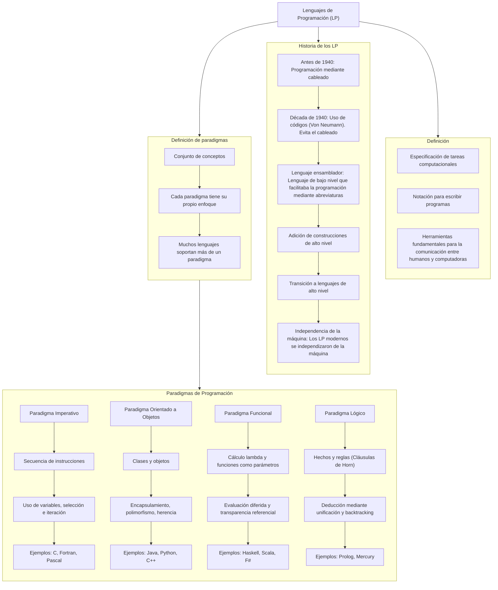

# Caracteristicas_Lenguajes_Programacion
# TP 1


# TP 3

# Gramáticas Formales para Emojicode: GIC, BNF, EBNF y ABNF

Emojicode es un lenguaje de programación esotérico de propósito general que utiliza emojis como elementos sintácticos primarios. Representa una fusión única entre:

Semántica de lenguajes convencionales (como Python o Java)

Sintaxis basada completamente en Unicode Emoji

Paradigmas de programación orientada a objetos y procedural

### Origen y Filosofía:
Creado en 2016 por Theo Weidmann, surge como crítica/exploración de:

La universalidad de los emojis como lenguaje visual global

La posibilidad de construir sistemas formales sobre símbolos no tradicionales

Un experimento sobre cognición y programación

## 1. GIC (Gramática Independiente del Contexto) para Emojicode

```plaintext
Programa       → 🏁 Bloque 🍉
Bloque         → Instrucción Bloque | Instrucción | λ
Instrucción    → Imprimir | Declaración | Bucle | Condicional | λ
Imprimir       → 😀 Expresión
Declaración    → 🍿 Variable Expresión
Bucle          → 🔁 Expresión ( Bloque )
Condicional    → 🤔 Operación ( Bloque ) | 🤔 Operación ( Bloque ) 🙁 ( Bloque ) 
Expresión      → 🔤Texto🔤 | Variable | Número | Operación
Operación      → Expresión Operador Expresión
Operador       → ➕ | ➖ | ✖️ | ➗ | ✍️
Variable       → A|B|C| ... |Z|a|b|c|...|z
Número         → 0|1|...|9
Texto          → Variable | Número     
```

---

## 2. BNF para Emojicode


```bnf
<Programa>    ::= 🏁 <Bloque> 🍉
<Bloque>      ::= <Instrucción> <Bloque> | λ
<Instrucción> ::= <Imprimir> | <Declaracion> | <Bucle> | <Condicional>
<Imprimir>    ::= 😀 <Expresión>
<Declaracion> ::= 🍿 <Variable> <Expresión>
<Bucle>       ::= 🔁 <Expresión> <Bloque>
<Condicional> ::= 🤔 <Operación> <Bloque> [🙁 <Bloque>]
<Expresión>   ::= 🔤<Texto>🔤 | <Variable> | <Número> | <Operación>
<Operación>   ::= <Expresión> <Operador> <Expresión>
<Operador>    ::= ➕ | ➖ | ✖️ | ➗ | ✍️
<Variable>    ::= A|B|C| ... |Z|a|b|c|...|z
<Número>      ::= 0|1|...|9
<Texto>       ::= <Variable> | <Número> 
```
---

## 3. EBNF para Emojicode

```ebnf
Programa     = 🏁 Bloque 🍉

Bloque       = { Instrucción }

Instrucción  = Imprimir | Declaración | Bucle | Condicional

Imprimir     = 😀 Expresión;

Declaración  = 🍿 Variable Expresión  

Bucle        = 🔁 Expresión Bloque

Condicional  = 🤔 Operación Bloque [🙁 Bloque]

Expresión    = 🔤Texto🔤 | Variable | Número | Operación | "(" Expresión ")"

Operación    = Expresión Operador Expresión

Operador     = ➕ | ➖ | ✖️  | ➗ | ✍️

Variable     = letra { letra | digito | _ }*

Número       = [ + | - ] digito { digito }*

Texto        = { letra* | digito* } 

letra       =  A | ... | Z | a | ... | z

digito        = 0 | ... | 9
```

---

## 4. ABNF para Emojicode


```abnf
programa : 🏁  
           bloque 
           🍉  

bloque : instruccion 
         bloque instruccion

instruccion : 😀 expresion  
              🍿 variable expresion  
              🔁 expresion bloque  
              🤔 Operación bloque 🙁 bloque

expresion : 🔤 cadena 🔤 
            numero
            variable
            operacion
            ( expresion )

numero : signo _op 
         digito _op

signo : uno de + -

digito : uno de 0-9

operacion : expresion 
            operador 
            expresion

operador : uno de ➕ ➖ ✖️ ➗ ✍️

variable : letra _op 
           letraodigito _op

letraodigito : uno de letra digito

letra : una de a-z A-Z

cadena : uno de numero letra
```
---

## Ejemplo Práctico Comparado

**Programa en Emojicode:**

```emojicode
🏁
  😀 🔤Hola🔤
  🍿 x 10
  🤔 x ➖ 1 ✖️ 2 🙁
    😀 🔤x es par🔤
  🙁
    😀 🔤x es impar🔤
  🔁 x 😀 x 🍿 x x ➖ 1
🍉
```
**Programa en Python:**

```Python
print("Hola")
x = 10
while x > 0:
    if x % 2 == 0:
        print(f"{x} es par")
    else:
        print(f"{x} es impar")
    x -= 1
```

---
# TP 4
## Arbol de Análisis Sintáctico de un Programa Fuente
```
🏁
  🍿 i 0
  🔁 i <= 5 (
    🤔 i ➗ 2 == ✍️ 0(
      😀 🔤Par🔤 i
    ) 🙁 (
      😀 🔤Impar🔤 i
    )
    🍿 i i + 1
  )
🍉
```


## Diagrama sintáctico de EMOJICODE


