# Caracteristicas_Lenguajes_Programacion
# TP 1

```mermaid
flowchart TD

subgraph DEF["Definición"]
    direction LR
    C["Especificación de tareas computacionales"]
    D["Notación para escribir programas"]
    E["Herramientas fundamentales para la comunicación entre humanos y computadoras"]
end

subgraph HLP["Historia de los LP"]
    direction TB
    H1["Antes de 1940: Programación mediante cableado"] --> H3["Década de 1940: Uso de códigos (Von Neumann). Evita el cableado"]
    H3 --> H4["Lenguaje ensamblador: Lenguaje de bajo nivel que facilitaba la programación mediante abreviaturas"]
    H4 --> H5["Adición de construcciones de alto nivel"]
    H5 --> H6["Transición a lenguajes de alto nivel"]
    H6 --> H7["Independencia de la máquina: Los LP modernos se independizaron de la máquina"]
end

subgraph DDP["Definición de paradigmas"]
    direction TB
    DP1["Conjunto de conceptos"] --> DP2["Cada paradigma tiene su propio enfoque"] --> DP3["Muchos lenguajes soportan más de un paradigma"]
end

subgraph PDP["Paradigmas de Programación"]
    direction TB
    P1["Paradigma Imperativo"] --> PI1["Secuencia de instrucciones"]
    PI1 --> PI2["Uso de variables, selección e iteración"] --> PI3["Ejemplos: C, Fortran, Pascal"]

    P2["Paradigma Orientado a Objetos"] --> POO1["Clases y objetos"]
    POO1 --> POO2["Encapsulamiento, polimorfismo, herencia"] --> POO3["Ejemplos: Java, Python, C++"]

    P3["Paradigma Funcional"] --> PF1["Cálculo lambda y funciones como parámetros"]
    PF1 --> PF2["Evaluación diferida y transparencia referencial"] --> PF3["Ejemplos: Haskell, Scala, F#"]

    P4["Paradigma Lógico"] --> PL1["Hechos y reglas (Cláusulas de Horn)"]
    PL1 --> PL2["Deducción mediante unificación y backtracking"] --> PL3["Ejemplos: Prolog, Mercury"]
end

LP["Lenguajes de Programación (LP)"] --> DEF
LP --> HLP
LP --> DDP
DDP --> PDP
```

## Resumen: Introducción a los Lenguajes de Programación

### ¿Qué son los Lenguajes de Programación (LP)?

Los LP son herramientas fundamentales para la comunicación entre humanos y computadoras. Actúan como una notación específica que permite escribir programas, es decir, la especificación detallada de una tarea que una computadora debe ejecutar.

### Historia de los LP: Una Evolución hacia la Abstracción

- Inicios: La programación inicial se realizaba mediante cableado físico.
-  Década de 1940: La introducción de códigos (Von Neumann) marcó un avance significativo, evitando el engorroso cableado.
- Lenguaje Ensamblador: Surgió como una forma de facilitar la programación mediante abreviaturas nemotécnicas para las instrucciones y las direcciones de memoria. Sin embargo, seguía siendo un lenguaje de bajo nivel, dependiente de la arquitectura de la computadora y difícil de comprender.
- Hacia la Abstracción: Se incorporaron construcciones de mayor nivel como la asignación de valores, los bucles y las sentencias condicionales.
- Reflejo Inicial de la Arquitectura Von Neumann: Los primeros lenguajes reflejaban la arquitectura de Von Neumann, con una memoria unificada para datos y programas, y una unidad de procesamiento secuencial.
- Transición a Lenguajes de Alto Nivel: Los LP modernos se independizaron de la máquina, permitiendo describir el procesamiento de manera general, sin detallar cada instrucción a nivel de hardware.

### Lenguajes de Bajo Nivel en la Actualidad:

Aunque los lenguajes de alto nivel son predominantes, los lenguajes de bajo nivel como Assembler y Web Assembly aún tienen su utilidad en casos específicos donde el control a nivel de hardware o la eficiencia son críticos.
Paradigmas de Programación: Diferentes Enfoques para Resolver Problemas
Los paradigmas de programación ofrecen diferentes estilos y filosofías para abordar la creación de programas:
- Imperativo: Se centra en describir una secuencia de instrucciones que modifican el estado del programa. Ejemplos de construcciones clave son las variables, la secuencia de instrucciones, la selección (condicionales) y la iteración (bucles).
- Orientado a Objetos (OO): Organiza el código en torno a "objetos", que son instancias de "clases". Conceptos fundamentales incluyen la invocación de métodos, el encapsulamiento (ocultar el estado interno), el polimorfismo (objetos que pueden tomar muchas formas) y la herencia (creación de nuevas clases basadas en existentes).
- Funcional: Se basa en el concepto matemático de funciones. Características importantes son la composición de funciones, el cálculo lambda (funciones anónimas), la transparencia referencial (el resultado de una función depende solo de sus argumentos), la evaluación diferida (cálculos solo cuando son necesarios) y el tratamiento de las funciones como parámetros.
- Este resumen proporciona una visión general de la introducción a los lenguajes de programación, abarcando su definición, evolución histórica, la persistencia de los lenguajes de bajo nivel y los principales paradigmas que moldean la forma en que escribimos software hoy en día.


# TP 3

# Gramáticas Formales para Emojicode: GIC, BNF, EBNF y ABNF

Emojicode es un lenguaje de programación esotérico de propósito general que utiliza emojis como elementos sintácticos primarios. Representa una fusión única entre:

Semántica de lenguajes convencionales (como Python o Java)

Sintaxis basada completamente en Unicode Emoji

Paradigmas de programación orientada a objetos y procedural

### Origen y Filosofía:
Creado en 2016 por Theo Weidmann, surge como crítica/exploración de:

La universalidad de los emojis como lenguaje visual global

La posibilidad de construir sistemas formales sobre símbolos no tradicionales

Un experimento sobre cognición y programación

## 1. GIC (Gramática Independiente del Contexto) para Emojicode

```plaintext
<Programa>       → 🏁 <Bloque> 🍉
<Bloque>         → <Instrucción> <Bloque> | λ
<Instrucción>    → <Imprimir> | <Declaración> | <Bucle> | <Condicional>
<Imprimir>       → 😀 <Expresión>
<Declaración>    → 🍿 <Variable> <Expresión>
<Bucle>          → 🔁 <Expresión> <Bloque>
<Condicional>    → 🤔 <Expresión> <Bloque> [🙁 <Bloque>] 
<Expresión>      → 🔤<Texto>🔤 | <Variable> | <Número> | <Operación>
<Operación>      → <Expresión> <Operador> <Expresión>
<Operador>       → ➕ | ➖ | ✖️ | ➗
<Variable>       → A|B|C| ... |Z|a|b|c|...|z
<Número>         → 0|1|...|9
<Texto>          → <Variable> | <Número>     
```

---

## 2. BNF para Emojicode


```bnf
<Programa>    ::= 🏁 <Bloque> 🍉
<Bloque>      ::= <Instrucción> <Bloque> | λ
<Instrucción> ::= <Imprimir> | <Declaracion> | <Bucle> | <Condicional>
<Imprimir>    ::= 😀 <Expresión>
<Declaracion> ::= 🍿 <Variable> <Expresión>
<Bucle>       ::= 🔁 <Expresión> <Bloque>
<Condicional> ::= 🤔 <Expresión> <Bloque> [🙁 <Bloque>]
<Expresión>   ::= 🔤<Texto>🔤 | <Variable> | <Número> | <Operación>
<Operación>   ::= <Expresión> <Operador> <Expresión>
<Operador>    ::= ➕ | ➖ | ✖️ | ➗
<Variable>    ::= A|B|C| ... |Z|a|b|c|...|z
<Número>      ::= 0|1|...|9
<Texto>       ::= <Variable> | <Número> 
```
---

## 3. EBNF para Emojicode

```ebnf
Programa     = 🏁 Bloque 🍉

Bloque       = { Instrucción }

Instrucción  = Imprimir | Declaración | Bucle | Condicional

Imprimir     = 😀 Expresión;

Declaración  = 🍿 Variable Expresión  

Bucle        = 🔁 Expresión Bloque

Condicional  = 🤔 Expresión Bloque [🙁 Bloque]

Expresión    = 🔤Texto🔤 | Variable | Número | Operación | "(" Expresión ")"

Operación    = Expresión Operador Expresión

Operador     = ➕ | ➖ | ✖️  | ➗

Variable     = letra { letra | digito | _ }

Número       = [ + | - ] digito { digito }

Texto        = { letra | digito } 

letra       =  A | ... | Z | a | ... | z

digito        = 0 | ... | 9
```

---

## 4. ABNF para Emojicode


```abnf
programa : 🏁  
           bloque 
           🍉 

bloque : instruccion 
         bloque instruccion

instruccion : 😀 expresion  
              🍿 variable expresion  
              🔁 expresion bloque  
              🤔 expresion bloque 🙁 bloque

expresion : 🔤 cadena 🔤 
            numero
            variable
            operacion
            ( expresion )

numero : signo _op 
         digito _op

signo : uno de + -

digito : uno de 0-9

operacion : expresion 
            operador 
            expresion

operador : uno de ➕ ➖ ✖️ ➗  

variable : letra _op 
           letraodigito _op

letraodigito : uno de letra digito

letra : una de a-z A-Z

cadena : *(numero) *(letra)
```
---

## Ejemplo Práctico Comparado

**Programa en Emojicode:**

```emojicode
🏁
  😀 🔤Hola🔤
  🍿 x 10
  🤔 x ➖ 1 ✖️ 2 🙁
    😀 🔤x es par🔤
  🙁
    😀 🔤x es impar🔤
  🔁 x 😀 x 🍿 x x ➖ 1
🍉
```
**Programa en Python:**

```Python
print("Hola")
x = 10
while x > 0:
    if x % 2 == 0:
        print(f"{x} es par")
    else:
        print(f"{x} es impar")
    x -= 1
```

---
